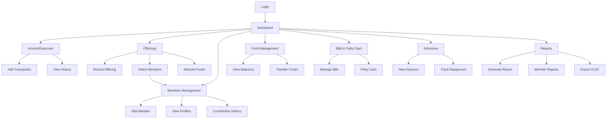

# Church Finance Management App - Product Requirements Document

## 1. Product Overview

A comprehensive Church Finance Management App designed to streamline financial operations for religious organizations, providing real-time tracking of funds, transactions, offerings, bills, and advances across multiple fund categories.

The system addresses the complex financial management needs of churches by offering dedicated modules for income/expense tracking, tithe and offering management, bill scheduling, advance money tracking, and comprehensive reporting with export capabilities.

## 2. Core Features

### 2.1 User Roles

| Role | Registration Method | Core Permissions |
|------|---------------------|------------------|
| Admin | Direct database setup | Full access to all features, user management, system configuration |
| Treasurer | Admin invitation | Create/edit transactions, manage bills, approve advances, generate reports |
| Viewer | Admin invitation | Read-only access to reports and transaction history |

### 2.2 Feature Module

Our Church Finance Management App consists of the following main pages:

1. **Dashboard**: Fund balance cards with real-time updates, recent transactions table, upcoming bill alerts, outstanding advances summary, quick action buttons
2. **Income & Expenses**: Transaction forms with category selection, real-time data table with sorting/filtering, fund allocation management
3. **Offerings & Tithes**: Tithe and offering tracking by type with individual member selection, fund allocation breakdown, service date and member contribution tracking, monthly/yearly summaries
4. **Members Management**: Brothers and sisters database with personal information (name, phone, fellowship/church name, job, location), contribution history tracking
5. **Fund Management**: Three separate funds (Management/Mission/Building) with individual tracking, transfer capabilities between funds, balance calculations
6. **Bills & Petty Cash**: Recurring bill management with due date alerts, status tracking, petty cash transactions with approval workflow
7. **Advances**: Advance money tracking per fund, recipient management, status tracking, partial repayment handling
8. **Reports & Export**: Monthly/yearly financial statements, fund-wise reports, member contribution reports, XLSX export with multiple sheets, custom date range filtering

### 2.3 Page Details

| Page Name | Module Name | Feature Description |
|-----------|-------------|---------------------|
| Dashboard | Fund Balance Cards | Display real-time balance for Management, Mission, and Building funds with visual indicators |
| Dashboard | Recent Transactions | Show last 10 transactions across all funds with quick filtering options |
| Dashboard | Bill Alerts | Display upcoming bills and overdue notifications with priority indicators |
| Dashboard | Advances Summary | Show outstanding advances by fund with total amounts and counts |
| Dashboard | Quick Actions | Provide shortcuts to add income, expense, offering, and bill payment |
| Income & Expenses | Transaction Form | Create income/expense entries with category, payment method, fund allocation, receipt tracking |
| Income & Expenses | Transaction Table | Display all transactions with sorting, filtering, pagination, and bulk operations |
| Income & Expenses | Category Management | Manage transaction categories (Tithes, Offerings, Utilities, Maintenance, Salaries) |
| Offerings & Tithes | Offering Entry | Record tithes and offerings by type with service date and individual member selection |
| Offerings & Tithes | Member Selection | Select specific brothers and sisters who contributed to each offering entry |
| Offerings & Tithes | Fund Allocation | Distribute offering amounts across multiple funds with percentage or fixed amounts |
| Offerings & Tithes | Summary Reports | Generate monthly/yearly offering summaries by type, fund, and member contributions |
| Members Management | Member Database | Maintain comprehensive database of brothers and sisters with personal information |
| Members Management | Member Profiles | Store name, phone, fellowship/church name, job, and location for each member |
| Members Management | Contribution History | Track individual member contribution history across all offerings and tithes |
| Members Management | Member Reports | Generate individual and collective member contribution reports |
| Fund Management | Fund Overview | Display individual fund balances, recent activity, and monthly trends |
| Fund Management | Fund Transfers | Transfer money between funds with approval workflow and audit trail |
| Fund Management | Monthly Statements | Generate detailed monthly statements per fund with income/expense breakdown |
| Bills & Petty Cash | Bill Management | Create recurring bills with frequency settings, due date tracking, and status updates |
| Bills & Petty Cash | Payment Processing | Record bill payments with fund allocation and receipt management |
| Bills & Petty Cash | Petty Cash Tracking | Manage petty cash transactions with approval workflow and receipt verification |
| Advances | Advance Request | Create advance requests with recipient details, purpose, expected return date |
| Advances | Repayment Tracking | Record partial and full repayments with automatic balance calculations |
| Advances | Approval Workflow | Manage advance approvals with authority levels and notification system |
| Reports & Export | Financial Reports | Generate comprehensive financial statements with customizable date ranges |
| Reports & Export | XLSX Export | Export data to Excel with multiple sheets for different fund categories |
| Reports & Export | Custom Filtering | Apply filters by date range, category, fund, and transaction type |

## 3. Core Process

### Admin Flow
1. Admin sets up initial funds and user accounts
2. Admin configures system settings and approval workflows
3. Admin monitors overall system usage and generates comprehensive reports

### Treasurer Flow
1. Treasurer logs in and views dashboard overview
2. Records daily transactions (income/expenses) with proper categorization
3. Manages weekly offerings and tithe entries with individual member selection and fund allocation
4. Maintains brothers and sisters database with personal information updates
5. Processes bill payments and manages recurring bills
6. Handles advance requests and tracks repayments
7. Generates monthly reports including member contribution analysis for church leadership

### Viewer Flow
1. Viewer accesses read-only dashboard
2. Views transaction history and fund balances
3. Generates basic reports within permitted scope

## 4. User Interface Design

### 4.1 Design Style

- **Primary Colors**: Blue (#3B82F6) for primary actions, Green (#10B981) for income/positive values
- **Secondary Colors**: Red (#EF4444) for expenses/alerts, Gray (#6B7280) for neutral elements
- **Button Style**: Rounded corners (8px radius) with subtle shadows and hover effects
- **Font**: Inter font family with 14px base size, 16px for headings, 12px for captions
- **Layout Style**: Card-based design with clean spacing, top navigation with sidebar for main sections
- **Icons**: Lucide React icons for consistency, financial-themed icons for fund categories

### 4.2 Page Design Overview

| Page Name | Module Name | UI Elements |
|-----------|-------------|-------------|
| Dashboard | Fund Cards | Grid layout with 3 cards, each showing fund name, balance, and trend indicator with blue/green color scheme |
| Dashboard | Transactions Table | Clean table with alternating row colors, sortable headers, and action buttons in primary blue |
| Income & Expenses | Form Components | shadcn/ui form elements with proper spacing, date picker with calendar popup, select dropdowns with search |
| Income & Expenses | Data Table | Responsive table with pagination, filtering sidebar, and bulk action toolbar |
| Offerings | Entry Form | Multi-step form with member selection dropdown, fund allocation sliders, and service date selection |
| Members Management | Member Database | Searchable table with member profiles, contact information, and quick action buttons |
| Members Management | Member Form | Comprehensive form with fields for name, phone, fellowship/church name, job, and location |
| Members Management | Contribution Tracking | Individual member contribution history with charts and summary statistics |
| Fund Management | Balance Overview | Large balance displays with trend charts, transfer buttons with confirmation modals |
| Bills | Bill Cards | Card layout with due date badges, status indicators (green/yellow/red), and quick action buttons |
| Advances | Status Tracking | Progress bars for repayment status, recipient cards with contact information |
| Reports | Export Interface | Filter panel on left, preview area in center, export options with format selection |

### 4.3 Responsiveness

The application is designed mobile-first with responsive breakpoints at 768px (tablet) and 1024px (desktop). Touch-friendly interfaces are optimized for mobile devices with larger tap targets and swipe gestures for table navigation. Desktop version features expanded sidebar navigation and multi-column layouts for efficient data entry and viewing.