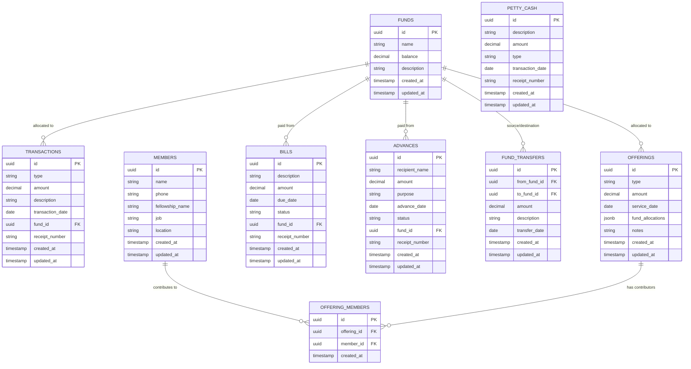

# Church Finance Management App - Technical Architecture Document

## 1. Architecture Design


## 2. Technology Description

* Frontend: Next.js\@14 + React\@18 + TypeScript + Tailwind CSS + shadcn/ui + react-hook-form + SheetJS

* Backend: Supabase (PostgreSQL + Auth + Real-time)

* Deployment: Vercel (optimized for Next.js)

## 3. Route Definitions

| Route            | Purpose                                             |
| ---------------- | --------------------------------------------------- |
| /                | Redirect to dashboard or login based on auth status |
| /login           | Authentication page with Supabase Auth              |
| /dashboard       | Main dashboard with fund overview and quick stats   |
| /income-expenses | Income and expense transaction management           |
| /offerings       | Tithe and offering tracking with member selection and fund allocation |
| /members         | Brothers and sisters database management with personal information |
| /funds           | Fund management and transfer operations             |
| /bills           | Bill tracking and petty cash management             |
| /advances        | Advance money tracking and repayment management     |
| /reports         | Financial reporting and XLSX export functionality   |

## 4. API Definitions

### 4.1 Core API

**Authentication (Handled by Supabase Auth)**

```
POST /auth/v1/token
```

**Fund Operations**

```
GET /rest/v1/funds
POST /rest/v1/funds
PATCH /rest/v1/funds?id=eq.{id}
```

Request (Create Fund):

| Param Name       | Param Type | isRequired | Description                             |
| ---------------- | ---------- | ---------- | --------------------------------------- |
| name             | string     | true       | Fund name (Management/Mission/Building) |
| current\_balance | number     | true       | Initial balance amount                  |

Response:

| Param Name       | Param Type | Description            |
| ---------------- | ---------- | ---------------------- |
| id               | uuid       | Unique fund identifier |
| name             | string     | Fund name              |
| current\_balance | number     | Current fund balance   |
| created\_at      | timestamp  | Creation timestamp     |

**Transaction Operations**

```
GET /rest/v1/transactions
POST /rest/v1/transactions
PATCH /rest/v1/transactions?id=eq.{id}
DELETE /rest/v1/transactions?id=eq.{id}
```

Request (Create Transaction):

| Param Name        | Param Type | isRequired | Description              |
| ----------------- | ---------- | ---------- | ------------------------ |
| type              | string     | true       | 'income' or 'expense'    |
| amount            | number     | true       | Transaction amount       |
| description       | string     | true       | Transaction description  |
| category          | string     | true       | Transaction category     |
| payment\_method   | string     | true       | 'cash' or 'bank'         |
| fund\_id          | uuid       | true       | Associated fund ID       |
| transaction\_date | date       | true       | Date of transaction      |
| receipt\_number   | string     | false      | Receipt reference number |

**Member Operations**

```
GET /rest/v1/members
POST /rest/v1/members
PATCH /rest/v1/members?id=eq.{id}
DELETE /rest/v1/members?id=eq.{id}
```

Request (Create Member):

| Param Name       | Param Type | isRequired | Description                    |
| ---------------- | ---------- | ---------- | ------------------------------ |
| name             | string     | true       | Full name of the member        |
| phone            | string     | false      | Contact phone number           |
| fellowship\_name | string     | false      | Fellowship or church name      |
| job              | string     | false      | Occupation or job title        |
| location         | string     | false      | Address or location            |

**Offering Operations**

```
GET /rest/v1/offerings
POST /rest/v1/offerings
PATCH /rest/v1/offerings?id=eq.{id}
```

Request (Create Offering):

| Param Name        | Param Type | isRequired | Description                                 |
| ----------------- | ---------- | ---------- | ------------------------------------------- |
| type              | string     | true       | 'tithe', 'lords\_day', 'special', 'mission' |
| amount            | number     | true       | Total offering amount                       |
| service\_date     | date       | true       | Service date                                |
| member\_ids       | array      | false      | Array of contributing member IDs            |
| fund\_allocations | jsonb      | true       | Fund allocation breakdown                   |
| notes             | string     | false      | Additional notes                            |

**Bill Operations**

```
GET /rest/v1/bills
POST /rest/v1/bills
PATCH /rest/v1/bills?id=eq.{id}
```

Request (Create Bill):

| Param Name   | Param Type | isRequired | Description                                  |
| ------------ | ---------- | ---------- | -------------------------------------------- |
| vendor\_name | string     | true       | Vendor or service provider name              |
| amount       | number     | true       | Bill amount                                  |
| due\_date    | date       | true       | Payment due date                             |
| frequency    | string     | true       | 'one-time', 'monthly', 'quarterly', 'yearly' |
| category     | string     | true       | Bill category                                |
| fund\_id     | uuid       | true       | Fund to pay from                             |

**Advance Operations**

```
GET /rest/v1/advances
POST /rest/v1/advances
PATCH /rest/v1/advances?id=eq.{id}
```

Request (Create Advance):

| Param Name             | Param Type | isRequired | Description               |
| ---------------------- | ---------- | ---------- | ------------------------- |
| recipient\_name        | string     | true       | Name of advance recipient |
| amount                 | number     | true       | Advance amount            |
| purpose                | string     | true       | Purpose of advance        |
| advance\_date          | date       | true       | Date advance was given    |
| expected\_return\_date | date       | true       | Expected return date      |
| fund\_id               | uuid       | true       | Fund providing advance    |
| approved\_by           | string     | true       | Approving authority       |
| notes                  | string     | false      | Additional notes          |

## 5. Data Model

### 5.1 Data Model Definition



### 5.2 Data Definition Language

**Funds Table**

```sql
-- Create funds table
CREATE TABLE funds (
    id UUID PRIMARY KEY DEFAULT gen_random_uuid(),
    name VARCHAR(50) NOT NULL CHECK (name IN ('Management', 'Mission', 'Building')),
    current_balance DECIMAL(12,2) DEFAULT 0.00,
    created_at TIMESTAMP WITH TIME ZONE DEFAULT NOW()
);

-- Create index
CREATE INDEX idx_funds_name ON funds(name);

-- RLS Policies
ALTER TABLE funds ENABLE ROW LEVEL SECURITY;
GRANT SELECT ON funds TO anon;
GRANT ALL PRIVILEGES ON funds TO authenticated;

-- Initial data
INSERT INTO funds (name, current_balance) VALUES
('Management', 50000.00),
('Mission', 25000.00),
('Building', 75000.00);
```

**Transactions Table**

```sql
-- Create transactions table
CREATE TABLE transactions (
    id UUID PRIMARY KEY DEFAULT gen_random_uuid(),
    type VARCHAR(10) NOT NULL CHECK (type IN ('income', 'expense')),
    amount DECIMAL(12,2) NOT NULL CHECK (amount > 0),
    description VARCHAR(255) NOT NULL,
    category VARCHAR(100) NOT NULL,
    payment_method VARCHAR(10) NOT NULL CHECK (payment_method IN ('cash', 'bank')),
    fund_id UUID NOT NULL REFERENCES funds(id),
    transaction_date DATE NOT NULL,
    receipt_number VARCHAR(50),
    created_by UUID REFERENCES auth.users(id),
    created_at TIMESTAMP WITH TIME ZONE DEFAULT NOW()
);

-- Create indexes
CREATE INDEX idx_transactions_fund_id ON transactions(fund_id);
CREATE INDEX idx_transactions_date ON transactions(transaction_date DESC);
CREATE INDEX idx_transactions_type ON transactions(type);
CREATE INDEX idx_transactions_category ON transactions(category);

-- RLS Policies
ALTER TABLE transactions ENABLE ROW LEVEL SECURITY;
GRANT SELECT ON transactions TO anon;
GRANT ALL PRIVILEGES ON transactions TO authenticated;
```

**Members Table**

```sql
-- Create members table
CREATE TABLE members (
    id UUID PRIMARY KEY DEFAULT gen_random_uuid(),
    name VARCHAR(100) NOT NULL,
    phone VARCHAR(20),
    fellowship_name VARCHAR(100),
    job VARCHAR(100),
    location VARCHAR(200),
    created_at TIMESTAMP WITH TIME ZONE DEFAULT NOW(),
    updated_at TIMESTAMP WITH TIME ZONE DEFAULT NOW()
);

-- Create indexes
CREATE INDEX idx_members_name ON members(name);
CREATE INDEX idx_members_fellowship ON members(fellowship_name);
CREATE INDEX idx_members_created_at ON members(created_at DESC);

-- RLS Policies
ALTER TABLE members ENABLE ROW LEVEL SECURITY;
GRANT SELECT ON members TO anon;
GRANT ALL PRIVILEGES ON members TO authenticated;
```

**Offerings Table**

```sql
-- Create offerings table
CREATE TABLE offerings (
    id UUID PRIMARY KEY DEFAULT gen_random_uuid(),
    type VARCHAR(20) NOT NULL CHECK (type IN ('tithe', 'lords_day', 'special', 'mission')),
    amount DECIMAL(12,2) NOT NULL CHECK (amount > 0),
    service_date DATE NOT NULL,
    fund_allocations JSONB NOT NULL,
    notes TEXT,
    created_at TIMESTAMP WITH TIME ZONE DEFAULT NOW(),
    updated_at TIMESTAMP WITH TIME ZONE DEFAULT NOW()
);

-- Create indexes
CREATE INDEX idx_offerings_service_date ON offerings(service_date DESC);
CREATE INDEX idx_offerings_type ON offerings(type);
CREATE INDEX idx_offerings_fund_allocations ON offerings USING GIN(fund_allocations);

-- RLS Policies
ALTER TABLE offerings ENABLE ROW LEVEL SECURITY;
GRANT SELECT ON offerings TO anon;
GRANT ALL PRIVILEGES ON offerings TO authenticated;
```

**Offering Members Junction Table**

```sql
-- Create offering_members table
CREATE TABLE offering_members (
    id UUID PRIMARY KEY DEFAULT gen_random_uuid(),
    offering_id UUID NOT NULL REFERENCES offerings(id) ON DELETE CASCADE,
    member_id UUID NOT NULL REFERENCES members(id) ON DELETE CASCADE,
    created_at TIMESTAMP WITH TIME ZONE DEFAULT NOW(),
    UNIQUE(offering_id, member_id)
);

-- Create indexes
CREATE INDEX idx_offering_members_offering_id ON offering_members(offering_id);
CREATE INDEX idx_offering_members_member_id ON offering_members(member_id);
CREATE INDEX idx_offering_members_created_at ON offering_members(created_at DESC);

-- RLS Policies
ALTER TABLE offering_members ENABLE ROW LEVEL SECURITY;
GRANT SELECT ON offering_members TO anon;
GRANT ALL PRIVILEGES ON offering_members TO authenticated;
```

**Bills Table**

```sql
-- Create bills table
CREATE TABLE bills (
    id UUID PRIMARY KEY DEFAULT gen_random_uuid(),
    vendor_name VARCHAR(255) NOT NULL,
    amount DECIMAL(12,2) NOT NULL CHECK (amount > 0),
    due_date DATE NOT NULL,
    frequency VARCHAR(20) NOT NULL CHECK (frequency IN ('one-time', 'monthly', 'quarterly', 'yearly')),
    status VARCHAR(20) DEFAULT 'pending' CHECK (status IN ('pending', 'paid', 'overdue')),
    category VARCHAR(100) NOT NULL,
    fund_id UUID NOT NULL REFERENCES funds(id),
    created_at TIMESTAMP WITH TIME ZONE DEFAULT NOW()
);

-- Create indexes
CREATE INDEX idx_bills_due_date ON bills(due_date);
CREATE INDEX idx_bills_status ON bills(status);
CREATE INDEX idx_bills_fund_id ON bills(fund_id);

-- RLS Policies
ALTER TABLE bills ENABLE ROW LEVEL SECURITY;
GRANT SELECT ON bills TO anon;
GRANT ALL PRIVILEGES ON bills TO authenticated;
```

**Advances Table**

```sql
-- Create advances table
CREATE TABLE advances (
    id UUID PRIMARY KEY DEFAULT gen_random_uuid(),
    recipient_name VARCHAR(255) NOT NULL,
    amount DECIMAL(12,2) NOT NULL CHECK (amount > 0),
    purpose VARCHAR(500) NOT NULL,
    advance_date DATE NOT NULL,
    expected_return_date DATE NOT NULL,
    status VARCHAR(20) DEFAULT 'outstanding' CHECK (status IN ('outstanding', 'partial', 'returned')),
    amount_returned DECIMAL(12,2) DEFAULT 0.00 CHECK (amount_returned >= 0),
    payment_method VARCHAR(10) NOT NULL CHECK (payment_method IN ('cash', 'bank')),
    fund_id UUID NOT NULL REFERENCES funds(id),
    approved_by VARCHAR(255) NOT NULL,
    notes TEXT,
    created_at TIMESTAMP WITH TIME ZONE DEFAULT NOW()
);

-- Create indexes
CREATE INDEX idx_advances_status ON advances(status);
CREATE INDEX idx_advances_fund_id ON advances(fund_id);
CREATE INDEX idx_advances_expected_return ON advances(expected_return_date);

-- RLS Policies
ALTER TABLE advances ENABLE ROW LEVEL SECURITY;
GRANT SELECT ON advances TO anon;
GRANT ALL PRIVILEGES ON advances TO authenticated;
```

**Petty Cash Table**

```sql
-- Create petty_cash table
CREATE TABLE petty_cash (
    id UUID PRIMARY KEY DEFAULT gen_random_uuid(),
    amount DECIMAL(12,2) NOT NULL CHECK (amount > 0),
    purpose VARCHAR(500) NOT NULL,
    transaction_date DATE NOT NULL,
    approved_by VARCHAR(255) NOT NULL,
    receipt_available BOOLEAN DEFAULT false,
    created_at TIMESTAMP WITH TIME ZONE DEFAULT NOW()
);

-- Create indexes
CREATE INDEX idx_petty_cash_date ON petty_cash(transaction_date DESC);
CREATE INDEX idx_petty_cash_approved_by ON petty_cash(approved_by);

-- RLS Policies
ALTER TABLE petty_cash ENABLE ROW LEVEL SECURITY;
GRANT SELECT ON petty_cash TO anon;
GRANT ALL PRIVILEGES ON petty_cash TO authenticated;
```

**Database Functions and Triggers**

```sql
-- Function to update fund balance
CREATE OR REPLACE FUNCTION update_fund_balance()
RETURNS TRIGGER AS $$
BEGIN
    IF TG_OP = 'INSERT' THEN
        IF NEW.type = 'income' THEN
            UPDATE funds SET current_balance = current_balance + NEW.amount WHERE id = NEW.fund_id;
        ELSE
            UPDATE funds SET current_balance = current_balance - NEW.amount WHERE id = NEW.fund_id;
        END IF;
        RETURN NEW;
    ELSIF TG_OP = 'DELETE' THEN
        IF OLD.type = 'income' THEN
            UPDATE funds SET current_balance = current_balance - OLD.amount WHERE id = OLD.fund_id;
        ELSE
            UPDATE funds SET current_balance = current_balance + OLD.amount WHERE id = OLD.fund_id;
        END IF;
        RETURN OLD;
    END IF;
    RETURN NULL;
END;
$$ LANGUAGE plpgsql;

-- Trigger for automatic fund balance updates
CREATE TRIGGER trigger_update_fund_balance
    AFTER INSERT OR DELETE ON transactions
    FOR EACH ROW EXECUTE FUNCTION update_fund_balance();
```

