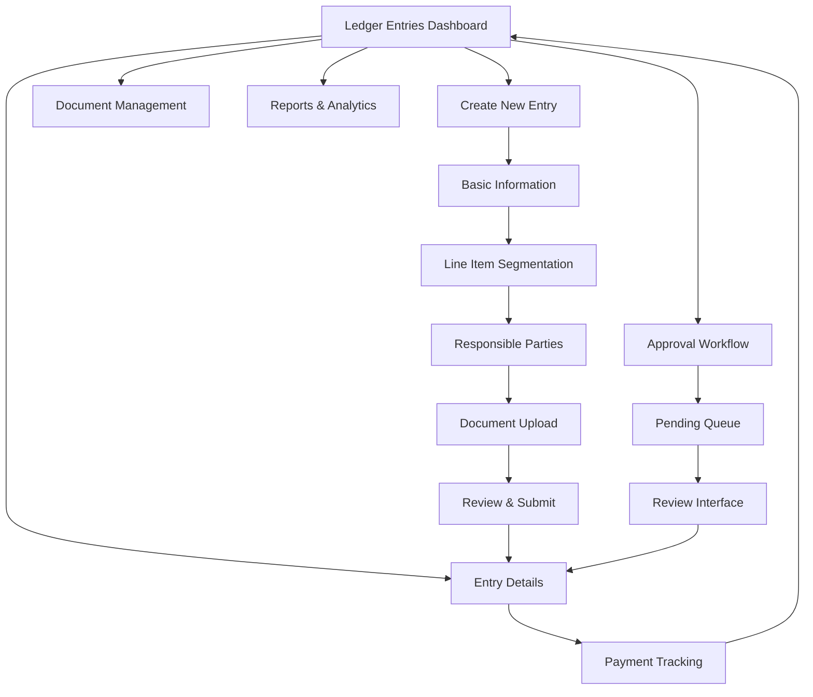

# Enhanced Ledger Entries Management System - Product Requirements Document

## 1. Product Overview

Transform the existing basic bill management system into a comprehensive "Ledger Entries" management platform that supports consolidated billing records, multiple responsible parties, document attachments, and professional financial workflows.

The system addresses the need for sophisticated financial record management in church operations, enabling detailed expense tracking with proper accountability, document management, and professional financial reporting standards.

## 2. Core Features

### 2.1 User Roles

| Role | Registration Method | Core Permissions |
|------|---------------------|------------------|
| Financial Administrator | Admin assignment | Full access to create, edit, approve, and manage all ledger entries |
| Department Manager | Role-based assignment | Can create and manage entries for assigned departments/funds |
| Approver | Designated by admin | Can approve pending entries and view assigned entries |
| Viewer | Standard user access | Read-only access to approved entries within permissions |

### 2.2 Feature Module

Our enhanced ledger entries system consists of the following main pages:

1. **Ledger Entries Dashboard**: Overview statistics, recent entries, pending approvals, overdue items
2. **Create Ledger Entry**: Multi-step entry creation with segmentation, responsible party assignment, document upload
3. **Entry Details**: Comprehensive view with line items, documents, approval history, payment tracking
4. **Approval Workflow**: Dedicated interface for reviewing and approving pending entries
5. **Document Management**: Centralized view of all attached receipts and supporting documents
6. **Reports & Analytics**: Financial reports, spending analysis, responsible party summaries

### 2.3 Page Details

| Page Name | Module Name | Feature Description |
|-----------|-------------|--------------------|
| Ledger Entries Dashboard | Statistics Overview | Display total pending amounts, overdue entries count, recent activity with animated counters |
| Ledger Entries Dashboard | Quick Actions | Create new entry, bulk approve, export reports with prominent action buttons |
| Ledger Entries Dashboard | Entry List | Filterable table with status badges, due dates, amounts, responsible parties |
| Create Ledger Entry | Basic Information | Vendor details, primary purpose, total amount, due date with validation |
| Create Ledger Entry | Line Item Segmentation | Add multiple line items with individual purposes, amounts, allocation percentages |
| Create Ledger Entry | Responsible Parties | Assign individuals/groups to entire entry or specific line items with notification settings |
| Create Ledger Entry | Document Upload | Drag-and-drop interface for receipts (JPG, PNG, PDF) with preview and validation |
| Create Ledger Entry | Review & Submit | Summary view with edit capabilities before final submission |
| Entry Details | Entry Overview | Complete entry information with status timeline and approval history |
| Entry Details | Line Items Management | Detailed breakdown with edit capabilities for authorized users |
| Entry Details | Document Viewer | Embedded document viewer with download, replace, and annotation features |
| Entry Details | Payment Tracking | Payment status, method, date with integration to fund management |
| Approval Workflow | Pending Queue | List of entries requiring approval with priority indicators |
| Approval Workflow | Review Interface | Side-by-side view of entry details and documents for approval decision |
| Approval Workflow | Batch Operations | Select multiple entries for bulk approval or rejection |
| Document Management | Document Library | Searchable repository of all uploaded documents with metadata |
| Document Management | Storage Analytics | Storage usage, file type distribution, cleanup recommendations |
| Reports & Analytics | Spending Analysis | Charts and graphs showing spending patterns by category, responsible party |
| Reports & Analytics | Export Functions | Generate PDF/Excel reports with customizable date ranges and filters |

## 3. Core Process

### Financial Administrator Flow
1. Access Ledger Entries Dashboard → Review pending approvals and overdue items
2. Create New Entry → Input basic information → Add line item segmentation → Assign responsible parties → Upload supporting documents → Submit for approval workflow
3. Manage existing entries → Edit details → Update payment status → Generate reports

### Department Manager Flow
1. Create entries for assigned department → Follow segmentation process → Submit for approval
2. Monitor assigned entries → Track approval status → Update payment information when authorized

### Approver Flow
1. Access Approval Workflow → Review pending entries → Examine documents → Approve or reject with comments
2. Batch process multiple entries → Set approval priorities → Generate approval reports

## 4. User Interface Design

### 4.1 Design Style
- **Primary Colors**: Deep blue (#1e40af) for headers and primary actions, light blue (#dbeafe) for backgrounds
- **Secondary Colors**: Green (#10b981) for approved status, amber (#f59e0b) for pending, red (#ef4444) for overdue
- **Button Style**: Rounded corners (8px radius) with subtle shadows and hover animations
- **Typography**: Inter font family, 16px base size for body text, 24px for headings
- **Layout Style**: Card-based design with glass morphism effects, consistent with existing dashboard
- **Icons**: Lucide React icons for consistency, financial-themed icons (receipt, file-text, credit-card)

### 4.2 Page Design Overview

| Page Name | Module Name | UI Elements |
|-----------|-------------|-------------|
| Ledger Entries Dashboard | Statistics Cards | Glass cards with animated counters, gradient backgrounds, status-specific color coding |
| Ledger Entries Dashboard | Entry Table | Sortable columns, status badges, action dropdowns, responsive design with mobile optimization |
| Create Ledger Entry | Multi-step Form | Progress indicator, step validation, auto-save functionality, responsive layout |
| Create Ledger Entry | Document Upload | Drag-and-drop zone with file preview, progress bars, format validation messages |
| Entry Details | Document Viewer | Modal overlay with zoom controls, navigation between documents, download buttons |
| Approval Workflow | Review Cards | Side-by-side layout with entry summary and document preview, approve/reject buttons |
| Reports & Analytics | Charts | Interactive charts using Chart.js, export buttons, date range selectors |

### 4.3 Responsiveness
- **Desktop-first design** with mobile-adaptive breakpoints at 768px and 1024px
- **Touch interaction optimization** for mobile approval workflows and document viewing
- **Progressive disclosure** on smaller screens with collapsible sections and drawer navigation
- **Optimized document viewing** with pinch-to-zoom and swipe navigation on mobile devices