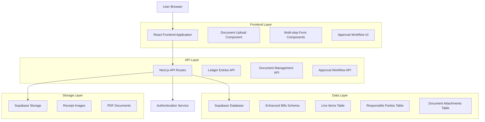
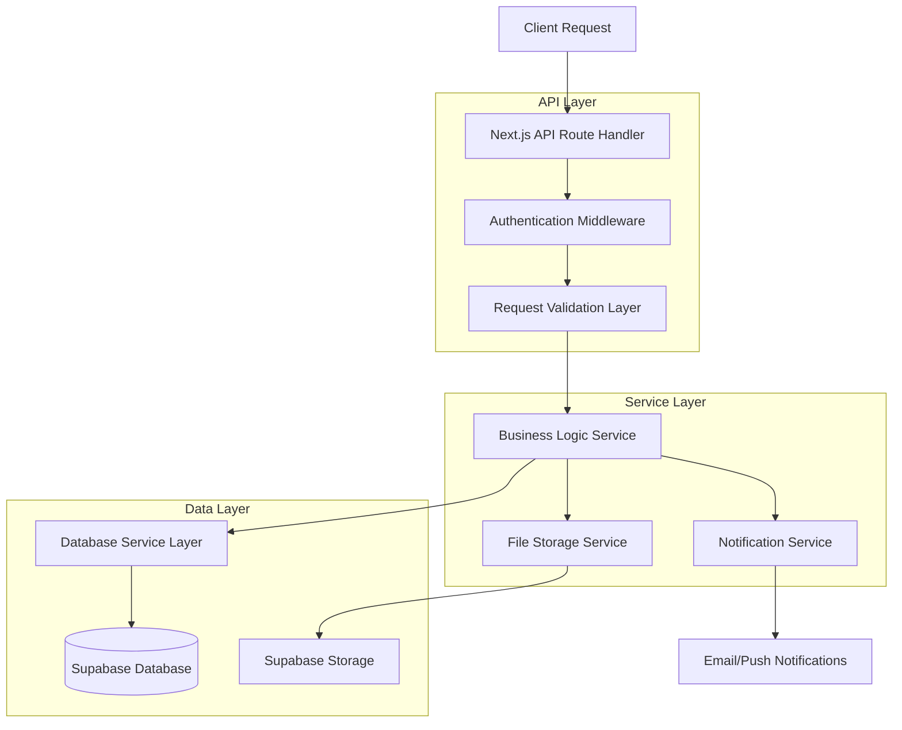
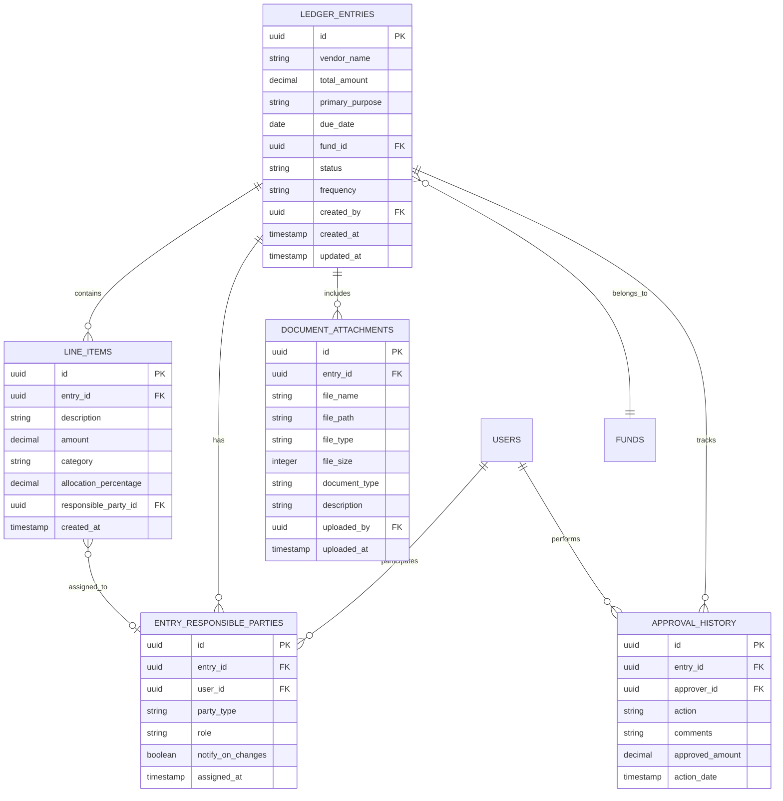

# Enhanced Ledger Entries System - Technical Architecture Document

## 1. Architecture Design



## 2. Technology Description

* **Frontend**: React\@18 + TypeScript + Tailwind CSS + Next.js\@14

* **Backend**: Next.js API Routes + Supabase

* **Database**: Supabase (PostgreSQL)

* **File Storage**: Supabase Storage

* **Authentication**: Supabase Auth

* **UI Components**: Shadcn/ui + Lucide React Icons

* **File Upload**: React Dropzone + Image Preview

* **Charts**: Chart.js for analytics

## 3. Route Definitions

| Route                      | Purpose                                     |
| -------------------------- | ------------------------------------------- |
| /ledger-entries            | Main dashboard with overview and entry list |
| /ledger-entries/create     | Multi-step entry creation form              |
| /ledger-entries/\[id]      | Detailed view of specific entry             |
| /ledger-entries/\[id]/edit | Edit existing entry (authorized users)      |
| /ledger-entries/approve    | Approval workflow interface                 |
| /ledger-entries/documents  | Document management center                  |
| /ledger-entries/reports    | Analytics and reporting dashboard           |

## 4. API Definitions

### 4.1 Core API Endpoints

**Ledger Entries Management**

```
GET /api/ledger-entries
```

Request Parameters:

| Param Name         | Param Type | isRequired | Description                                |
| ------------------ | ---------- | ---------- | ------------------------------------------ |
| status             | string     | false      | Filter by status (pending, approved, paid) |
| responsible\_party | string     | false      | Filter by responsible party ID             |
| date\_from         | string     | false      | Start date for filtering (ISO format)      |
| date\_to           | string     | false      | End date for filtering (ISO format)        |
| fund\_id           | string     | false      | Filter by fund ID                          |

Response:

| Param Name   | Param Type | Description                   |
| ------------ | ---------- | ----------------------------- |
| entries      | array      | Array of ledger entry objects |
| total\_count | number     | Total number of entries       |
| pagination   | object     | Pagination metadata           |

**Create Ledger Entry**

```
POST /api/ledger-entries
```

Request:

| Param Name           | Param Type | isRequired | Description                            |
| -------------------- | ---------- | ---------- | -------------------------------------- |
| vendor\_name         | string     | true       | Vendor or payee name                   |
| total\_amount        | number     | true       | Total entry amount                     |
| primary\_purpose     | string     | true       | Main purpose category                  |
| due\_date            | string     | true       | Due date (ISO format)                  |
| fund\_id             | string     | true       | Associated fund ID                     |
| line\_items          | array      | false      | Array of line item objects             |
| responsible\_parties | array      | false      | Array of responsible party assignments |
| documents            | array      | false      | Array of document attachment IDs       |

**Line Items Management**

```
POST /api/ledger-entries/[id]/line-items
```

Request:

| Param Name             | Param Type | isRequired | Description                                           |
| ---------------------- | ---------- | ---------- | ----------------------------------------------------- |
| description            | string     | true       | Line item description                                 |
| amount                 | number     | true       | Line item amount                                      |
| category               | string     | true       | Sub-category classification                           |
| allocation\_percentage | number     | false      | Percentage of total (auto-calculated if not provided) |
| responsible\_party\_id | string     | false      | Specific responsible party for this line item         |

**Document Management**

```
POST /api/ledger-entries/[id]/documents
```

Request (multipart/form-data):

| Param Name     | Param Type | isRequired | Description                                  |
| -------------- | ---------- | ---------- | -------------------------------------------- |
| file           | File       | true       | Document file (JPG, PNG, PDF)                |
| document\_type | string     | true       | Type: receipt, invoice, supporting\_document |
| description    | string     | false      | Document description                         |

**Approval Workflow**

```
PUT /api/ledger-entries/[id]/approve
```

Request:

| Param Name       | Param Type | isRequired | Description                                   |
| ---------------- | ---------- | ---------- | --------------------------------------------- |
| action           | string     | true       | approve or reject                             |
| comments         | string     | false      | Approval/rejection comments                   |
| approved\_amount | number     | false      | Approved amount (if different from requested) |

Example Request:

```json
{
  "vendor_name": "Office Supply Store",
  "total_amount": 250.00,
  "primary_purpose": "Office Supplies",
  "due_date": "2024-02-15",
  "fund_id": "fund_management_001",
  "line_items": [
    {
      "description": "Printer Paper",
      "amount": 150.00,
      "category": "Stationery",
      "allocation_percentage": 60
    },
    {
      "description": "Ink Cartridges",
      "amount": 100.00,
      "category": "Equipment",
      "allocation_percentage": 40
    }
  ],
  "responsible_parties": [
    {
      "party_id": "user_123",
      "party_type": "individual",
      "role": "requester"
    }
  ]
}
```

## 5. Server Architecture Diagram



## 6. Data Model

### 6.1 Data Model Definition



### 6.2 Data Definition Language

**Enhanced Ledger Entries Table**

```sql
-- Rename and enhance existing bills table
ALTER TABLE bills RENAME TO ledger_entries;

-- Add new columns for enhanced functionality
ALTER TABLE ledger_entries 
ADD COLUMN primary_purpose VARCHAR(255),
ADD COLUMN total_amount DECIMAL(10,2),
ADD COLUMN created_by UUID REFERENCES auth.users(id),
ADD COLUMN updated_at TIMESTAMP WITH TIME ZONE DEFAULT NOW();

-- Update existing columns
ALTER TABLE ledger_entries 
ALTER COLUMN status TYPE VARCHAR(20),
ADD CONSTRAINT status_check CHECK (status IN ('pending', 'approved', 'paid', 'rejected', 'overdue'));

-- Create indexes
CREATE INDEX idx_ledger_entries_status ON ledger_entries(status);
CREATE INDEX idx_ledger_entries_due_date ON ledger_entries(due_date);
CREATE INDEX idx_ledger_entries_created_by ON ledger_entries(created_by);
```

**Line Items Table**

```sql
CREATE TABLE line_items (
    id UUID PRIMARY KEY DEFAULT gen_random_uuid(),
    entry_id UUID NOT NULL REFERENCES ledger_entries(id) ON DELETE CASCADE,
    description VARCHAR(500) NOT NULL,
    amount DECIMAL(10,2) NOT NULL CHECK (amount > 0),
    category VARCHAR(100) NOT NULL,
    allocation_percentage DECIMAL(5,2) CHECK (allocation_percentage >= 0 AND allocation_percentage <= 100),
    responsible_party_id UUID REFERENCES auth.users(id),
    created_at TIMESTAMP WITH TIME ZONE DEFAULT NOW()
);

CREATE INDEX idx_line_items_entry_id ON line_items(entry_id);
CREATE INDEX idx_line_items_category ON line_items(category);
```

**Entry Responsible Parties Table**

```sql
CREATE TABLE entry_responsible_parties (
    id UUID PRIMARY KEY DEFAULT gen_random_uuid(),
    entry_id UUID NOT NULL REFERENCES ledger_entries(id) ON DELETE CASCADE,
    user_id UUID NOT NULL REFERENCES auth.users(id),
    party_type VARCHAR(20) NOT NULL CHECK (party_type IN ('individual', 'group', 'department')),
    role VARCHAR(50) NOT NULL CHECK (role IN ('requester', 'approver', 'accountable', 'informed')),
    notify_on_changes BOOLEAN DEFAULT true,
    assigned_at TIMESTAMP WITH TIME ZONE DEFAULT NOW()
);

CREATE INDEX idx_responsible_parties_entry_id ON entry_responsible_parties(entry_id);
CREATE INDEX idx_responsible_parties_user_id ON entry_responsible_parties(user_id);
CREATE UNIQUE INDEX idx_unique_entry_user_role ON entry_responsible_parties(entry_id, user_id, role);
```

**Document Attachments Table**

```sql
CREATE TABLE document_attachments (
    id UUID PRIMARY KEY DEFAULT gen_random_uuid(),
    entry_id UUID NOT NULL REFERENCES ledger_entries(id) ON DELETE CASCADE,
    file_name VARCHAR(255) NOT NULL,
    file_path VARCHAR(500) NOT NULL,
    file_type VARCHAR(10) NOT NULL CHECK (file_type IN ('jpg', 'jpeg', 'png', 'pdf')),
    file_size INTEGER NOT NULL CHECK (file_size > 0),
    document_type VARCHAR(50) NOT NULL CHECK (document_type IN ('receipt', 'invoice', 'supporting_document', 'approval_form')),
    description TEXT,
    uploaded_by UUID NOT NULL REFERENCES auth.users(id),
    uploaded_at TIMESTAMP WITH TIME ZONE DEFAULT NOW()
);

CREATE INDEX idx_document_attachments_entry_id ON document_attachments(entry_id);
CREATE INDEX idx_document_attachments_type ON document_attachments(document_type);
```

**Approval History Table**

```sql
CREATE TABLE approval_history (
    id UUID PRIMARY KEY DEFAULT gen_random_uuid(),
    entry_id UUID NOT NULL REFERENCES ledger_entries(id) ON DELETE CASCADE,
    approver_id UUID NOT NULL REFERENCES auth.users(id),
    action VARCHAR(20) NOT NULL CHECK (action IN ('submitted', 'approved', 'rejected', 'returned')),
    comments TEXT,
    approved_amount DECIMAL(10,2),
    action_date TIMESTAMP WITH TIME ZONE DEFAULT NOW()
);

CREATE INDEX idx_approval_history_entry_id ON approval_history(entry_id);
CREATE INDEX idx_approval_history_approver_id ON approval_history(approver_id);
CREATE INDEX idx_approval_history_action_date ON approval_history(action_date DESC);
```

**Row Level Security Policies**

```sql
-- Enable RLS on all tables
ALTER TABLE ledger_entries ENABLE ROW LEVEL SECURITY;
ALTER TABLE line_items ENABLE ROW LEVEL SECURITY;
ALTER TABLE entry_responsible_parties ENABLE ROW LEVEL SECURITY;
ALTER TABLE document_attachments ENABLE ROW LEVEL SECURITY;
ALTER TABLE approval_history ENABLE ROW LEVEL SECURITY;

-- Ledger entries policies
CREATE POLICY "Users can view entries they are responsible for" ON ledger_entries
    FOR SELECT USING (
        auth.uid() IN (
            SELECT user_id FROM entry_responsible_parties WHERE entry_id = ledger_entries.id
        ) OR 
        auth.uid() = created_by
    );

CREATE POLICY "Users can create entries" ON ledger_entries
    FOR INSERT WITH CHECK (auth.uid() = created_by);

CREATE POLICY "Users can update entries they created or are responsible for" ON ledger_entries
    FOR UPDATE USING (
        auth.uid() = created_by OR
        auth.uid() IN (
            SELECT user_id FROM entry_responsible_parties 
            WHERE entry_id = ledger_entries.id AND role IN ('requester', 'approver')
        )
    );

-- Grant permissions to authenticated users
GRANT SELECT ON ledger_entries TO authenticated;
GRANT INSERT ON ledger_entries TO authenticated;
GRANT UPDATE ON ledger_entries TO authenticated;
GRANT DELETE ON ledger_entries TO authenticated;

GRANT ALL PRIVILEGES ON line_items TO authenticated;
GRANT ALL PRIVILEGES ON entry_responsible_parties TO authenticated;
GRANT ALL PRIVILEGES ON document_attachments TO authenticated;
GRANT ALL PRIVILEGES ON approval_history TO authenticated;
```

