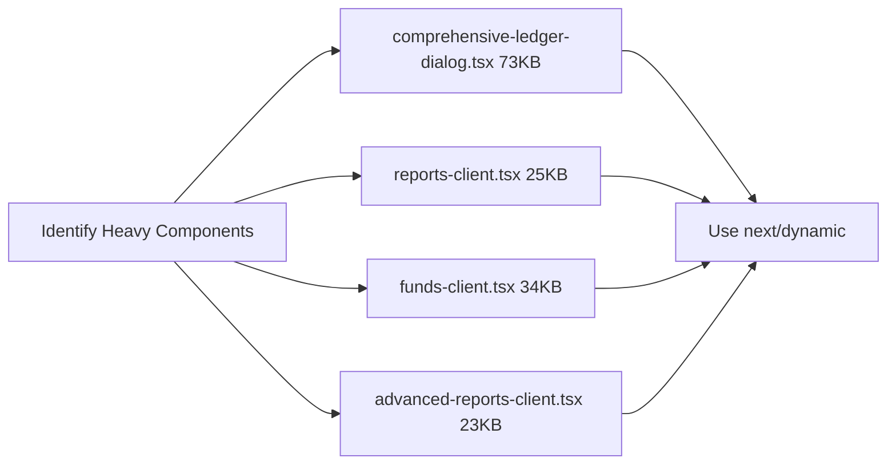

# Phase 4: Performance & Polish - Implementation Plan

## Overview

This phase focuses on optimizing application performance through code splitting, implementing memoization, adding SEO metadata, and setting up Progressive Web App (PWA) capabilities. Based on the current codebase analysis, several tasks from the comprehensive analysis have already been addressed (e.g., loading states, error boundaries from Phase 1).

## Current State Analysis

### Already Implemented ✅

- Loading skeletons (`loading.tsx`) exist for: transactions, offerings, bills, funds, members, admin
- Error boundaries (`error.tsx`) exist at: root, dashboard group, admin group
- Custom 404 page (`not-found.tsx`) exists at root
- Zod validation schemas created in `lib/validations/`
- `useDataFetching` hook exists in `lib/hooks/`

### Remaining for Phase 4 🔲

- Dynamic imports for large components
- Virtual scrolling for large tables
- React.memo for list items
- Bundle analyzer configuration
- SEO metadata completion
- PWA manifest and service worker

---

## Tasks to Complete

### 1. Dynamic Imports for Large Components

**Objective:** Reduce initial bundle size by lazy-loading heavy dialog components.

#### 1.1 ComprehensiveLedgerDialog (73KB)

- **Current:** Direct import in `components/ledger-entries-client.tsx` line 9
- **Issue:** Loaded on every page render, not needed on initial load
- **Solution:** Use `next/dynamic` to lazy-load only when dialog opens

**Files to modify:**

- `components/ledger-entries-client.tsx`

#### 1.2 Other Large Dialog Components

Search for other heavy components that should be dynamically imported:



**Files to analyze:**

- `components/comprehensive-ledger-dialog.tsx`
- `components/reports-client.tsx`
- `components/advanced-reports-client.tsx`
- `components/funds-client.tsx`

### 2. React.memo for List Item Components

**Objective:** Prevent unnecessary re-renders of list items in data tables.

#### 2.1 Create Memoized Table Row Components

**Components to create/modify:**

- `components/ui/table-row.tsx` - Memoized table row for transactions
- `components/ui/memoized-list-item.tsx` - Generic memoized list item
- Modify `components/transactions-client.tsx` to use memoized rows
- Modify `components/members-client.tsx` to use memoized rows
- Modify `components/offerings-client.tsx` (inline) to use memoized rows
- Modify `components/bills-client.tsx` (inline) to use memoized rows

**Example pattern:**

```typescript
// Before
const TransactionRow = ({ transaction }) => (
  <tr>{/* row content */}</tr>
)

// After
import { memo } from 'react'

const TransactionRow = memo(function TransactionRow({ transaction }) {
  return (
    <tr>{/* row content */}</tr>
  )
})

TransactionRow.displayName = 'TransactionRow'
```

### 3. Virtual Scrolling for Large Data Tables

**Objective:** Handle tables with 100+ rows efficiently.

#### 3.1 Install virtualization library

- Already available: `react` and `react-dom` support windowing
- Consider using `@tanstack/react-virtual` for more features

#### 3.2 Pages requiring virtual scrolling:

- `app/(dashboard)/transactions/page.tsx` - Transactions list
- `app/(dashboard)/bills/page.tsx` - Bills list (72KB inline)
- `app/(dashboard)/offerings/page.tsx` - Offerings list (42KB inline)
- `app/(dashboard)/members/page.tsx` - Members list
- `app/(dashboard)/ledger-entries/page.tsx` - Ledger entries

**Implementation approach:**

```typescript
import { useVirtualizer } from "@tanstack/react-virtual";

const tableRef = useRef<HTMLDivElement>(null);
const rowVirtualizer = useVirtualizer({
  count: transactions.length,
  getScrollElement: () => tableRef.current,
  estimateSize: () => 50,
  overscan: 5,
});
```

### 4. Bundle Analysis Configuration

**Objective:** Measure and monitor bundle sizes.

#### 4.1 Configure @next/bundle-analyzer

**File to modify:** `next.config.mjs`

```javascript
const withBundleAnalyzer = require("@next/bundle-analyzer")({
  enabled: process.env.ANALYZE === "true",
});

// Update module.exports:
module.exports = withBundleAnalyzer(nextConfig);
```

#### 4.2 Add analyze script to package.json

```json
"scripts": {
  "analyze": "ANALYZE=true next build",
  "analyze:server": "ANALYZE=true next build --server",
  "analyze:browser": "ANALYZE=true next build"
}
```

#### 4.3 Run initial analysis

- Analyze client bundle
- Analyze server bundle
- Identify largest modules
- Create optimization targets

### 5. SEO Metadata Completion

**Objective:** Add metadata to all pages for improved search visibility.

#### 5.1 Pages WITH Metadata (8 pages) ✅

- `app/(dashboard)/dashboard/page.tsx` - "Dashboard | Church Finance"
- `app/(dashboard)/transactions/page.tsx` - "Transactions | Church Finance"
- `app/(dashboard)/reports/page.tsx` - "Reports | Church Finance"
- `app/(dashboard)/members/page.tsx` - "Members | Church Finance"
- `app/(dashboard)/member-contributions/page.tsx` - "Member Contributions | Church Finance"
- `app/(dashboard)/ledger-entries/page.tsx` - "Ledger Entries | Church Finance"
- `app/(dashboard)/funds/page.tsx` - "Fund Management | Church Finance"
- `app/(dashboard)/cash-breakdown/page.tsx` - "Cash Breakdown | Church Finance"

#### 5.2 Pages WITHOUT Metadata (12 pages) 🔲

**Add to these files:**

| Page                                           | Title                                    | Description                                    |
| ---------------------------------------------- | ---------------------------------------- | ---------------------------------------------- |
| `app/(dashboard)/offerings/page.tsx`           | Offerings \| Church Finance              | View and manage church offerings and donations |
| `app/(dashboard)/bills/page.tsx`               | Bills \| Church Finance                  | Track and manage church bills and payments     |
| `app/(dashboard)/advances/page.tsx`            | Advances \| Church Finance               | Manage staff advances and repayments           |
| `app/(dashboard)/notifications/page.tsx`       | Notifications \| Church Finance          | View system notifications and alerts           |
| `app/(dashboard)/preferences/page.tsx`         | Preferences \| Church Finance            | Configure your account preferences             |
| `app/(dashboard)/profile-settings/page.tsx`    | Profile Settings \| Church Finance       | Update your profile information                |
| `app/(dashboard)/reconciliation/page.tsx`      | Bank Reconciliation \| Church Finance    | Reconcile bank statements with records         |
| `app/(dashboard)/reconciliation/[id]/page.tsx` | Reconciliation Details \| Church Finance | View reconciliation session details            |
| `app/(dashboard)/admin/churches/page.tsx`      | Manage Churches \| Church Finance        | Admin: Manage church organizations             |
| `app/(dashboard)/admin/roles/page.tsx`         | Manage Roles \| Church Finance           | Admin: Configure user roles and permissions    |
| `app/(dashboard)/admin/users/page.tsx`         | Manage Users \| Church Finance           | Admin: Manage user accounts                    |
| `app/(dashboard)/admin/user-roles/page.tsx`    | User Roles \| Church Finance             | Admin: Assign roles to users                   |

#### 5.3 Add Open Graph and Twitter Cards

Extend metadata in root layout and key pages:

```typescript
export const metadata: Metadata = {
  title: "...",
  description: "...",
  openGraph: {
    title: "...",
    description: "...",
    type: "website",
  },
  twitter: {
    card: "summary_large_image",
  },
};
```

### 6. PWA Setup (Progressive Web App)

**Objective:** Enable offline support and installability.

#### 6.1 Create PWA Manifest

**File to create:** `public/manifest.json`

```json
{
  "name": "Church Finance Management",
  "short_name": "ChurchFinance",
  "description": "Comprehensive financial management system for churches",
  "start_url": "/",
  "display": "standalone",
  "background_color": "#0f172a",
  "theme_color": "#3b82f6",
  "icons": [
    {
      "src": "/icon-192.png",
      "sizes": "192x192",
      "type": "image/png"
    },
    {
      "src": "/icon-512.png",
      "sizes": "512x512",
      "type": "image/png"
    }
  ]
}
```

#### 6.2 Create Service Worker

**File to create:** `public/sw.js`

```javascript
const CACHE_NAME = "church-finance-v1";
const urlsToCache = ["/", "/dashboard", "/offline"];

self.addEventListener("install", (event) => {
  event.waitUntil(
    caches.open(CACHE_NAME).then((cache) => cache.addAll(urlsToCache)),
  );
});

self.addEventListener("fetch", (event) => {
  event.respondWith(
    caches.match(event.request).then((response) => {
      if (response) {
        return response;
      }
      return fetch(event.request);
    }),
  );
});
```

#### 6.3 Register Service Worker

**File to create:** `app/register-sw.tsx`

```typescript
"use client";

useEffect(() => {
  if ("serviceWorker" in navigator) {
    navigator.serviceWorker.register("/sw.js");
  }
}, []);
```

**Import in:** `app/layout.tsx`

#### 6.4 Create Offline Page

**File to create:** `app/offline/page.tsx`

```typescript
import Link from 'next/link'

export default function OfflinePage() {
  return (
    <div className="min-h-screen flex items-center justify-center">
      <div className="text-center">
        <h1>You're offline</h1>
        <p>Please check your internet connection.</p>
        <Link href="/">Return to Dashboard</Link>
      </div>
    </div>
  )
}
```

#### 6.5 Generate PWA Icons

Create placeholder icons or use a tool to generate:

- `public/icon-192.png` (192x192)
- `public/icon-512.png` (512x512)
- `public/favicon.ico` (already exists as favicon.svg)

---

## Implementation Order

### Week 1: Bundle Optimization

1. Configure @next/bundle-analyzer
2. Run initial bundle analysis
3. Implement dynamic imports for ComprehensiveLedgerDialog
4. Identify other candidates for code splitting

### Week 2: React Optimization

1. Create memoized table row components
2. Apply React.memo to list items in transactions
3. Apply React.memo to list items in members
4. Profile performance improvements

### Week 3: Virtual Scrolling

1. Install @tanstack/react-virtual
2. Implement virtual scrolling in transactions table
3. Implement virtual scrolling in bills table
4. Test with large datasets

### Week 4: SEO & PWA

1. Add metadata to all 12 missing pages
2. Create PWA manifest.json
3. Create service worker
4. Create offline page
5. Register service worker

---

## Success Criteria

### Performance

- [ ] Initial bundle size reduced by 20% via dynamic imports
- [ ] Table re-renders reduced via React.memo
- [ ] Large lists (100+ items) render smoothly with virtual scrolling

### SEO

- [ ] All 20 dashboard pages have unique metadata
- [ ] Open Graph tags present on key pages
- [ ] sitemap.xml generated (future task)

### PWA

- [ ] Manifest.json created and linked
- [ ] Service worker registered
- [ ] Offline page displays when network unavailable
- [ ] App installable on mobile devices

### Bundle Analysis

- [ ] `npm run analyze` works without errors
- [ ] Bundle analyzer report generated
- [ ] Known large modules identified and addressed

---

## Dependencies

**Already in package.json:**

- `@next/bundle-analyzer` - Bundle analysis
- `react` - React.memo
- `@tanstack/react-virtual` - Virtual scrolling (needs install)

**Need to add:**

- `@tanstack/react-virtual` - For virtual scrolling

---

## Files Summary

| Action       | Files                                                                                                                                                        |
| ------------ | ------------------------------------------------------------------------------------------------------------------------------------------------------------ |
| Modify       | `next.config.mjs`, `package.json`, `components/ledger-entries-client.tsx`                                                                                    |
| Create       | `public/manifest.json`, `public/sw.js`, `app/offline/page.tsx`, `app/register-sw.tsx`, `components/ui/memoized-list-item.tsx`, `components/ui/table-row.tsx` |
| Add Metadata | 12 page files (offerings, bills, advances, notifications, preferences, profile-settings, reconciliation, reconciliation/[id], admin/\*)                      |

---

## Notes

- The comprehensive-ledger-dialog is 73KB and is the primary target for dynamic imports
- The `useDataFetching` hook already exists and provides a good foundation for data fetching optimization
- PWA icons should match the glass-morphism theme colors
- Virtual scrolling should be progressive - only enable when list exceeds 50 items
